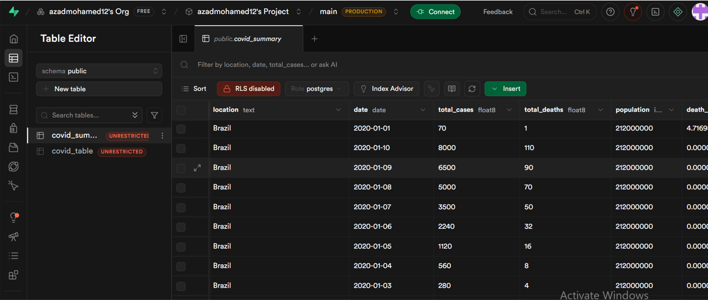
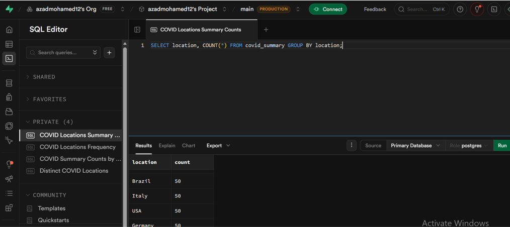
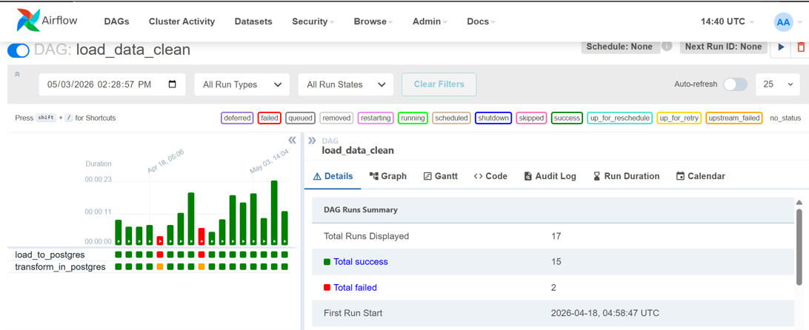
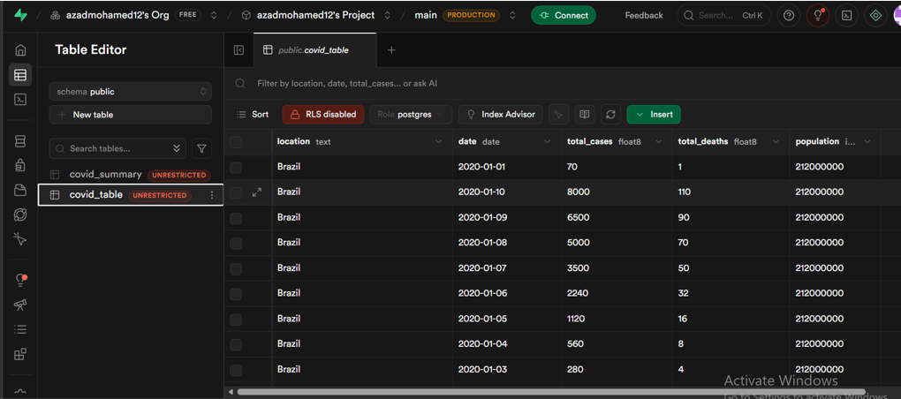

# 📊 COVID-19 Data Pipeline Project

## 🎯 Problem Description

The COVID-19 pandemic has been one of the most significant global health crises
in modern history, affecting millions of people across every country.
Governments, researchers, and public health organizations struggled to track
the spread of the virus and make data-driven decisions.

The challenge is that raw COVID-19 data is large, messy, and hard to analyze
without proper tooling. Analysts need a reliable, automated pipeline that:
- Collects raw COVID-19 data consistently
- Cleans and transforms it into an analyzable format
- Stores it in a structured data warehouse
- Presents insights through an interactive dashboard

This project solves that problem by building an end-to-end automated data
pipeline that ingests daily COVID-19 case and death data, loads it into
PostgreSQL on Supabase cloud, transforms it using dbt, and visualizes
key metrics through a Streamlit dashboard.

### ❓ Questions This Project Answers
- Which countries had the highest total COVID-19 cases?
- How did cases grow over time for each country?
- What is the maximum number of deaths recorded per country?
- How do different countries compare in case volume?

## 🏗️ Architecture

CSV Data → Airflow DAG → Supabase PostgreSQL (Cloud) → dbt → Streamlit Dashboard
## ⚙️ Tech Stack

| Tool | Purpose |
|------|---------|
| Apache Airflow | Workflow orchestration & scheduling |
| PostgreSQL (Supabase) | Cloud data warehouse |
| dbt | Data transformations & testing |
| Docker & Docker Compose | Containerization |
| Streamlit | Interactive dashboard |
| Python | Data processing |

## 🔄 Pipeline

1. Load CSV into Supabase PostgreSQL (cloud)
2. Transform data using dbt (staging → mart)
3. Calculate death rate per country
4. Store in partitioned `covid_summary` table
5. Visualize in Streamlit dashboard

## 📊 Dashboard Features

- **Raw data table** — view all processed COVID records
- **KPI metrics** — max cases and max deaths at a glance
- **Country filter** — select any country to analyze
- **Line chart** — cases over time per country
- **Bar chart** — total cases by country

## 📋 Prerequisites

Before running this project make sure you have:
- Docker Desktop installed (version 20.10 or higher)
- Python 3.8+
- Git
- dbt-postgres installed
- Ports **8081** (Airflow) and **5432** (Postgres) must be free

## ▶️ How to Run

### 1. Clone the repository
```bash
git clone https://github.com/azadmohamed12/covid-pipeline-project-wsl.git
cd covid-pipeline-project-wsl
```

### 2. Setup environment variables
```bash
cp .env.example .env
```

### 3. Start all services
```bash
docker compose up
```
Wait about 30 seconds for all services to start.

### 4. Setup Airflow Supabase Connection (Required!)
This step is required before triggering the DAG:
- Open http://localhost:8081 in your browser
- Login: username **admin** / password **admin**
- Go to **Admin → Connections → + Add a new record**
- Fill in:
  - **Connection Id:** supabase_postgres
  - **Connection Type:** Postgres
  - **Host:** aws-1-eu-central-1.pooler.supabase.com
  - **Database:** postgres
  - **Login:** postgres.cfhlplwncfryzbtunngo
  - **Password:** your Supabase password
  - **Port:** 5432
- Click **Save**

### 5. Trigger the DAG
```bash
airflow dags trigger load_data_clean
```
Or trigger manually from the Airflow UI at http://localhost:8081

### 6. Run dbt transformations
```bash
cd covid_dbt
dbt run
dbt test
```

### 7. Install dashboard dependencies
```bash
pip install -r requirements.txt
```

### 8. Run the dashboard
```bash
cd dashboard
streamlit run app.py
```
Open http://localhost:8501 in your browser.

## 📁 Project Structure

- dags/ → Airflow DAG
- data/ → Raw CSV files
- dashboard/ → Streamlit app
- covid_dbt/ → dbt models
- sql/ → SQL queries
- docker-compose.yml → All services
- requirements.txt → Python packages
- .env.example → Environment template
## 🔄 Transformations (dbt)

This project uses **dbt (Data Build Tool)** to transform raw COVID-19
data into clean, tested, and documented analytical models.

### 🏗️ Model Structure
**Staging** (`models/staging/stg_covid.sql`)
Cleans raw COVID data by filtering null values and selecting
relevant columns.

**Mart** (`models/marts/fct_covid_summary.sql`)
Final analytical model that adds death rate calculation on top
of the staging model.

### ✅ Data Quality Tests

| Test | Model | Result |
|------|-------|--------|
| not_null | stg_covid.location | ✅ PASS |
| not_null | stg_covid.date | ✅ PASS |
| not_null | fct_covid_summary.location | ✅ PASS |
| not_null | fct_covid_summary.death_rate | ✅ PASS |

## 🗄️ Data Warehouse Design

The `covid_summary` table is **partitioned by location (country)** because:

1. The dashboard filters data by country (SELECT dropdown)
2. The bar chart aggregates data by country
3. Partitioning means Postgres only scans the relevant country
   partition instead of the entire table — making queries faster

Each country has its own partition:
- `covid_summary_usa` → USA data
- `covid_summary_italy` → Italy data
- `covid_summary_germany` → Germany data
- `covid_summary_india` → India data
- `covid_summary_default` → any other country

## ☁️ Cloud Infrastructure (Supabase)

This project uses **Supabase** as a fully managed cloud PostgreSQL
database. The entire pipeline runs against the cloud database —
no local database required.

### Supabase Tables (Partitioned)


### Partition Architecture


### Live Cloud Data


### Query Results


## 📷 Screenshots

### Airflow DAGs


### Dashboard Views


### Processed Data

